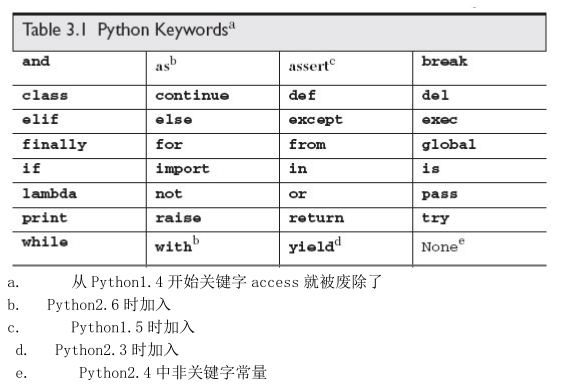

# Python核心编程学习笔记-第三章

## 一、Python标识符

Python标识符字符串规则：

- 第一个字符必须是字母或下划线（\_）
- 剩下的字符可以为字母或数字或下划线
- 大小写敏感

**除了下划线，其他符号是不允许的**

Python关键字：



## 二、Python 编程风格

```python
 #/usr/bin/env python
 
 #模块文档（文档字符串）
 ''this is a test module''
 
 #模块导入
 import sys
 import os
 
 #(全局)变量定义
 debug = True
 
 #类定义（若有）
 class FooClass(object):
     "Foo class"
     pass
     
#函数定义（若有）
def test():
    ''test function''
    foo = FooClass()
    if debug:
        print 'ran test()'

#主程序
if __name__ == '__main__':
    test()
```

**Python用缩进来分隔不同的代码组，Python的缩进一般为4个空格**

## 三、内存回收

- 当一个对象被创建时，就会创建一个引用计数，当对象被赋值给其他变量时，这个引用计数会+1
- 当对象的引用被销毁时，引用计数会减小
- 当对象的引用计数变为0的时候，它就会被垃圾回收

使用del命令删除对象的引用：`del obj`


