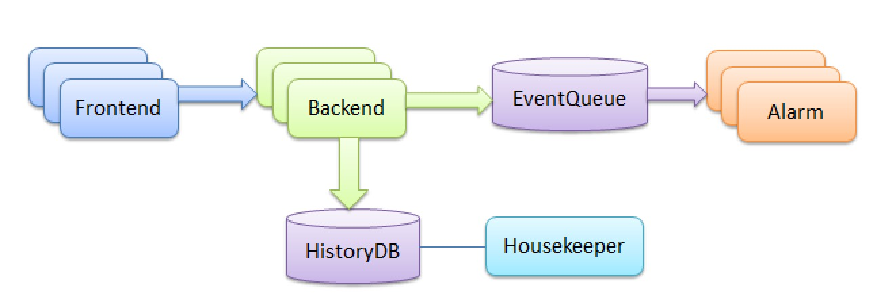

# OpenMinos监控实践

## 一、介绍
直接摘抄官方介绍，[官方Wiki](https://coding.net/u/ulricqin/p/open-minos-doc/git)

Minos是一款普适的监控系统，4个组件，5个repo，均使用Go编写，易于使用、易于运维、易于二次开发。理念灵感来自Zabbix、OpenTSDB、Open-Falcon、Borgmon。

## 二、架构设计



- Frontend：这是Minos的web端，可以在这里查看历史监控数据、配置报警、管理报警接收人、查看未恢复的报警等等。Frontend提供了http接口可以接收push上来的监控数据

- Backend：主要业务逻辑所在的模块，web端接收到数据之后转发给Backend集群，Backend会将数据写入

- HistoryDB（MySQL），做报警判断，如果产生了报警事件，写入EventQueue（Redis）

- Alarm：读取EventQueue中的报警事件，发送报警邮件或短信

- Housekeeper：清理老旧历史数据

## 三、安装部署

这里提供了我打包好的二进制，在2.6.32 x86_64 GNU/Linux下面做的，所以，请在64位linux下部署测试。

### 1、下载
```bash
#!/bin/sh
version=0.0.1
schema_tarball=http://120.134.33.178/download/minos-schema-$version.tar.gz
alarm_tarball=http://120.134.33.178/download/minos-alarm-$version.tar.gz
agent_tarball=http://120.134.33.178/download/minos-agent-$version.tar.gz
backend_tarball=http://120.134.33.178/download/minos-backend-$version.tar.gz
frontend_tarball=http://120.134.33.178/download/minos-frontend-$version.tar.gz
housekeeper_tarball=http://120.134.33.178/download/minos-housekeeper-$version.tar.gz

# 我们把这些组件解压缩到当前登录用户的家目录下的minos目录

cd ~
mkdir -p minos/tarball
cd minos/tarball
wget $schema_tarball
wget $alarm_tarball
wget $agent_tarball
wget $backend_tarball
wget $frontend_tarball
wget $housekeeper_tarball

cd ~/minos
mkdir -p {schema,alarm,agent,backend,frontend,housekeeper}

cd ~/minos/tarball
tar zxf minos-schema-$version.tar.gz -C ../schema
tar zxf minos-alarm-$version.tar.gz -C ../alarm
tar zxf minos-agent-$version.tar.gz -C ../agent
tar zxf minos-backend-$version.tar.gz -C ../backend
tar zxf minos-frontend-$version.tar.gz -C ../frontend
tar zxf minos-housekeeper-$version.tar.gz -C ../housekeeper
```

### 2、数据库

~/minos/schema下面有几个sql文件，依据这些sql文件创建数据库。为了容量考虑，从业务上做了分库处理，简单解释一下各个数据库的作用

- events.sql 事件库，存放当前未恢复的报警事件、历史所有报警事件

- frontend.sql 对应的是frontend库，存储用户信息、策略信息、团队信息

- history.sql 历史数据的库，这里支持分库分表，默认是分成了2个history库，每个库里10张表，刚开始搭建测试阶段大家就维持现状即可，等生产环境部署的时候可以增加库表数量，history.sql是使用history.sh生成的

- indexes.sql 索引库，上报的历史数据要能够在web端查看，需要建立索引

- naming.sql 存放一些naming信息，目前只是存放了backend列表，frontend要转发数据给backend，无需在frontend中配置backend列表，这个列表是从naming库中获取的

除了数据库，还需要redis，大家自行google安装方法

### 3、Housekeeper

先安装这个最简单的模块，这个模块是做清理的。历史数据没法长久保存，OpenMinos模仿zabbix的做法，创建了history表和trends表，分别存放原始数据和归档数据，归档周期是一小时一次。

进入housekeeper目录，看到一个cfg.json了吧，这是配置文件，根据需要自行修改。

下面几个关键的配置说明一下：

```
showSql: 程序在执行清理的时候是否打印sql语句
http: housekeeper目前的http端口没啥大的作用，主要用来监控housekeeper本身的存活性，可以通过配置enabled:false，来关闭http监听服务
clean.history_in_days: 历史数据最多存几天，超过了就删了，默认是1天，个人觉得够用了
clean.trends_in_days: 归档数据最多存几天，默认是365天，也就是一年喽
clean.interval_in_seconds: 这个清理动作的执行周期，默认是300s执行一次清理
database: 数据库的相关配置，默认是root账号，没密码，最好改成你们自己的账号，比如账号是minos，密码是123456，那数据库连接地址应该是：minos:123456@tcp(...
history.databaseCount: 历史数据支持分库分表，这里是告诉housekeeper分成了几个库，默认是2
history.tableCount: 历史数据支持分库分表，这里是告诉housekeeper每个库里分了几个表，默认是10
```

配置好了之后启动

`./control start`

怎么判断是否启动成功？

- 可以通过查看端口，housekeeper默认开启了http端口监听，使用的是6000，通过ss -tln，看看6000端口是否在监听

- 可以看log中是否有异常，log位置：var/app.log，也可以通过control脚本查看 ./control tail

- 可以查看进程状态，./control status

下面所述的其他组件都是相同的启动方式，相同的判断方式，不再赘述。

housekeeper模块可以部署多个，支持水平扩展，但是个人感觉没必要，就部署一个就行了，挂了再起就行，对整个系统没啥影响

### 4、Backend

熟悉Open-Falcon的同学可以把Backend当作是Judge、Graph的结合体。接收数据，生成索引，入库，判断数据是否触发了阀值，生成报警事件。

关键配置说明：

```
ip: 配置本机的内网ip，如果不配置，backend模块会自动探测，有多块网卡的时候有可能探测得不对，所以建议配置，这个ip地址会写到naming.backend表，frontend模块就是从这个表获取backend列表。backend组件通常部署多个，每次扩容，frontend通过naming库自动感知列表变化
writer: 写历史数据的时候，需要用多少个worker线程来干活，如果DB能力强，可以调大，这个最好咨询一下DBA，看你部署多少个backend，每个backend创建多少个worker
http: http接口目前没啥大作用，可以关闭
rpc: frontend模块通过这个rpc接口发送数据给backend模块
database: backend模块要建立索引，所以要连接indexes库，要生成报警事件，所以要连events库，要写历史数据，所以要连history库，要读取策略列表，所以要连frontend库，backend不会对frontend做写操作，如果frontend库做了主从，此处可以配置成从库
redis: 生成的报警事件写入redis
eventQueuePrefix: 这个配置很有意思，之后的文档会单独拿一节来说，先维持默认即可
```

启动方式和housekeeper一样。

backend模块业务逻辑比较重，支持水平扩展，看着扛不住了就多部署几个。

### 5、Frontend

OpenMinos的web端，支持水平扩展，最好在前端架设nginx做负载均衡

关键配置说明：

```
i18n: 国际化配置文件，默认是zh，表示中文，也可以选择en，表示英文，i18n工作还没有完全翻译完，努力进行中
salt: 加密密码的随机字符串
http.secret: 加密cookie的随机字符串
history.rawDays: 与housekeeper中的clean.history_in_days一个意思，表示原始数据存几天
redis: 这个redis实例是做缓存的，不像backend中的redis那么重要
cache.provider: 缓存支持内存缓存和redis缓存，此处默认配置成了内存缓存，如果只部署一个frontend组件，那就用memory，如果是部署多个frontend组件，那就用redis
canRegister: 系统是否支持注册
registerConfirm: 注册用户是否需要管理员审核方能登陆系统
ldap: Ldap配置，可以支持ldap登陆校验，不解释，具体可以咨询你们公司的ldap管理员，他对这个配置一看就懂
backend: frontend通过rpc发送数据给backend，这里是连接池的配置，维持默认即可
auths: 第三方系统调用frontend系统的接口的时候需要做一个简单的校验，这里配置的是授权的service及其password
回头看一眼frontend.sql，初始化的的时候已经自动插入了一个root账号，密码是a，建议现在立马登录系统，修改root密码。
```

### 6、Alarm

用来处理报警事件，发送报警的一个模块，支持水平扩展。注意到了么，OpenMinos的所有组件都是支持水平扩展的，无单点！

关键配置说明：

```
name和password: 需要存在于frontend配置文件中的auths，才能调用frontend接口，才能发送报警
http: 可以不开启，目前http没啥用
redis: 读取报警事件的redis
prefix: 需要存在于backend模块配置文件中的eventQueuePrefix，维持默认先
frontend: 配置了frontend的地址，为啥配置俩？
frontend.internal: alarm和frontend通常在一个内网，配置一个frontend的内网地址，alarm调用性能更好，也更安全
frontend.external: 发送的报警邮件中会带有报警事件对应的策略，用户一点击就可以看到，这个策略页面是frontend提供的，为了让用户可以点击这个链接，external需要配置成用户在浏览器端可以访问的frontend地址
concurrency: 发送邮件短信的时候的并发度
smtp: 邮件smtp服务器
sms: 各个公司自己的用来发送短信的http接口，支持POST和GET，params是调用这个http接口的时候需要传递的参数，key-value的形式，value中的`{phone}`和`{content}`，是alarm组件自动填充的
```

## 四、OpenMinos数据采集

OpenMinos数据采集采用接口方式，将采集的数据push到数据汇报地址。

### 1、数据汇报地址

OpenMinos整套系统的权限是围绕Team这个概念展开的，大家可以在web端创建一个Team，系统会自动为这个Team生成一个ID，一个Token，然后拿着这俩信息可以拼接出一个地址，假如frontend的域名是minos.a.xiaomi.com，那这个push的地址就是http://minos.a.xiaomi.com/push/$id/$token。
push到这个地址的数据，只有这个团队的人可以看。

### 2、数据组织格式

每条监控数据包含这么几个字段，下面简单做个解释：

```
metric: string，监控项的名称，你监控的是什么，比如qps、latency、cpu.idle、disk.io.util、agent.alive等等
tags: []string，监控项的一些描述信息可以组织到tag中，比如qps是哪个项目的哪个模块哪个机器的qps，tags的每一项都是key=value的形式，比如["project=minos", "module=backend", "host=10.1.2.3"]
value: int或者float都可以，监控项的值，不支持字符串
type: string，表示监控项的类型，只支持两种取值，一个GAUGE，另一个是COUNTER，下面做详细解析
timestamp: UNIX时间戳，单位是秒，汇报数据的那一刻的时间戳
```

- GAUGE:表示原值，即你汇报什么值，服务端就存储什么值，比如cpu.idle、load.1min就是原值，通常的监控项都是原值

- COUNTER:表示递增值，每次采集汇报的值是持续递增的，我们关注其变化率，比如系统自启动之后收到的网卡流量，就是一个COUNTER类型的值，系统刚启动，这个值是0，然后越来越大，越来越大，永远不会减小。我们不关心当前的值是多少，我们关心的是当前这一分钟的网卡流量是多少，即：(当前值-上一分钟的值)/(当前UNIX时间戳-上一分钟的UNIX时间戳)，如果你把type设置为COUNTER，OpenMinos服务端就会做这个计算。

服务端会把上次汇报的值缓存起来，当前这次值汇报上来之后，就可以做这个速率计算了。

请重视type的作用，如果设置的不对，根本达不到监控效果！

## 五、监控脚本

### 1、push数据

```python
#!/usr/bin/env python
# __*__ coding:utf-8 __*__

import time
import json
import urllib2

def push(metric,tags,value,type):
    p = []
    timestamp = int(time.time())

    i = {
        'metric':'%s' %metric,
        'tags':tags,
        'value':value,
        'timestamp':timestamp,
        'type':type
    }

    p.append(i)

    #print json.dumps(p, sort_keys=True, indent=4)

    method = "POST"
    handler = urllib2.HTTPHandler()
    opener = urllib2.build_opener(handler)
    url = 'http://****'
    request = urllib2.Request(url, data=json.dumps(p))
    request.add_header("Content-Type", 'application/json')
    request.get_method = lambda: method
    try:
        connection = opener.open(request)
    except urllib2.HTTPError, e:
        connection = e

    # check. Substitute with appropriate HTTP code.
    if connection.code == 200:
        print connection.read()
    else:
        print '{"err":1,"msg":"%s"}' % connection
```

### 2、系统资源监控

```python
#coding:utf-8

import time
import commands
from push import push

def read_cpu_usage():
    """Read the current system cpu usage from /proc/stat."""
    try:
        fd = open("/proc/stat", 'r')
        lines = fd.readlines()
    finally:
        if fd:
            fd.close()
    for line in lines:
        l = line.split()
        if len(l) < 5:
            continue
        if l[0].startswith('cpu'):
            return l
    return []


def get_cpu_usage(host,project):
    """
    get cpu avg used by percent
    """
    cpustr = read_cpu_usage()
    if not cpustr:
        return 0

    #CPU使用率计算方式
    #cpu usage=(idle2-idle1)/(cpu2-cpu1)*100
    #cpu usage=[(user_2 +sys_2+nice_2) - (user_1 + sys_1+nice_1)]/(total_2 - total_1)*100
    total1 = long(cpustr[1]) + long(cpustr[2]) + long(cpustr[3]) + long(cpustr[4]) + long(cpustr[5]) +  long(cpustr[6]) + long(cpustr[7])
    usn1 = long(cpustr[1]) + long(cpustr[2]) + long(cpustr[3])
    time.sleep(2)

    cpustr = read_cpu_usage()
    if not cpustr:
        return 0

    total2 = long(cpustr[1]) + long(cpustr[2]) + long(cpustr[3]) + long(cpustr[4]) + long(cpustr[5]) + long(cpustr[6]) + long(cpustr[7])
    usn2 = long(cpustr[1]) + long(cpustr[2]) + long(cpustr[3])
    cpuper = float(usn2 - usn1) / float(total2 - total1) *100
    push('Cpu.percent', ["team=sa", "host=" + host, "project=" + project], cpuper, 'GAUGE')

def get_mem(host,project):
    with open('/proc/meminfo') as f:
        total = int(f.readline().split()[1])
        free = int(f.readline().split()[1])
        buffers = int(f.readline().split()[1])
        cache = int(f.readline().split()[1])
    mem_use = total-free-buffers-cache
    push('mem.percent', ["team=sa", "host=" + host, "project=" + project], mem_use*100/total, 'GAUGE')


def get_net(em,host,project):
    net_re_a = commands.getoutput("cat /proc/net/dev | grep %s | tr : ' ' | awk '{print $2}'" % em)
    net_tr_a = commands.getoutput("cat /proc/net/dev | grep %s | tr : ' ' | awk '{print $10}'" % em)
    time.sleep(1)
    net_re_b = commands.getoutput("cat /proc/net/dev | grep %s | tr : ' ' | awk '{print $2}'" % em)
    net_tr_b = commands.getoutput("cat /proc/net/dev | grep %s | tr : ' ' | awk '{print $10}'" % em)

    net_re = int(float(net_re_b) - float(net_re_a))
    net_tr = int(float(net_tr_b)-float(net_tr_a))

    push('Net.Re',["team=sa","host="+host,"project="+project] ,net_re,'GAUGE')
    push('Net.Tr', ["team=sa", "host=" + host, "project=" + project], net_tr, 'GAUGE')

def main():
    get_cpu_usage('192.168.188.1', 'gzwx')
    get_mem('192.168.188.1', 'gzwx')
    get_net( 'em1', '192.168.188.1','gzwx')

if __name__ == "__main__":
    main()
```

### 3、Tomcat JVM监控

```python
#!/usr/bin/env python
# __*__ coding:utf-8 __*__

#需要安装jpype模块
import jpype
from jpype import java
from jpype import javax
from push import push


class jvm_monitor:
    def __init__(self, ip, port):

        if jpype.isJVMStarted():
            pass
        else:
            # jpype.startJVM(jpype.getDefaultJVMPath())
            jpype.startJVM("/usr/local/java/jdk1.7.0_79/jre/lib/amd64/server/libjvm.so", "-ea")
        # java.lang.System.out.println("JVM has been started.")

        self.url = "service:jmx:rmi:///jndi/rmi://%s:%d/jmxrmi" % (ip, port)

        environment = java.util.HashMap()
        # 认证用户密码
        credentials = jpype.JArray(java.lang.String)(["monitorRole", "pflm@monitor"])
        environment.put(javax.management.remote.JMXConnector.CREDENTIALS, credentials)

        self.jmxurl = javax.management.remote.JMXServiceURL(self.url)

        try:
            self.jmxc = javax.management.remote.JMXConnectorFactory.connect(self.jmxurl, environment)
            self.mbsc = self.jmxc.getMBeanServerConnection();
        except Exception, e:
            # Exit if we can not connect to the JMX url
            error = 'JMX Error connecting to ' + self.url
            java.lang.System.out.println(error)

    def get_data(self):

        jvm_data = {}

        # get attributes of Threading
        threading = "java.lang:type=Threading"
        peakThreadCount = "PeakThreadCount"
        threadCount = "ThreadCount"
        daemonThreadCount = "DaemonThreadCount"

        # 自JVM启动或峰复位以来的峰活动线程计数。
        # jvm_data['Threading.%s' %peakThreadCount]= self.mbsc.getAttribute(javax.management.ObjectName(threading), peakThreadCount)
        # 当前的活动守护线程和非守护线程数
        jvm_data['Threading.%s' % threadCount] = self.mbsc.getAttribute(javax.management.ObjectName(threading),
                                                                        threadCount)
        # 当前的活动守护线程数
        # jvm_data['Threading.%s' %daemonThreadCount] = self.mbsc.getAttribute(javax.management.ObjectName(threading), daemonThreadCount)


        # get attributes of Memory
        memory = "java.lang:type=Memory"
        hMemoryUsage = "HeapMemoryUsage"
        nonHMemoryUsage = "NonHeapMemoryUsage"

        # HeapMemoryUsage用于描述当前堆内存使用情况
        attr = self.mbsc.getAttribute(javax.management.ObjectName(memory), hMemoryUsage)
        jvm_data["Memory.%s.used" % hMemoryUsage] = attr.contents.get("used")
        # 表示可以用于内存管理的最大内存量
        jvm_data["Memory.%s.max" % hMemoryUsage] = attr.contents.get("max")
        # 表示保证java虚拟机能使用的内存量
        # jvm_data["Memory.%s.committed" % hMemoryUsage] = attr.contents.get("committed")

        '''
        # NonHeapMemoryUsage用于描述当前非堆内存使用情况
        attr=self.mbsc.getAttribute(javax.management.ObjectName(memory), nonHMemoryUsage)
        jvm_data["Memory.%s.used" % nonHMemoryUsage] = attr.contents.get("used")
        jvm_data["Memory.%s.max" % nonHMemoryUsage] = attr.contents.get("max")
        jvm_data["Memory.%s.committed" % nonHMemoryUsage] = attr.contents.get("committed")
        '''

        return jvm_data

    def push_data(self,host,port,project,jvm_data):
        Threading_ThreadCount = jvm_data['Threading.ThreadCount'].value
        HeapMemoryUsage_used = jvm_data['Memory.HeapMemoryUsage.used'].value
        HeapMemoryUsage_max = jvm_data['Memory.HeapMemoryUsage.max'].value

        push('Threading.ThreadCount', ["team=sa","host="+host,"port="+port,"project="+project] , Threading_ThreadCount, 'GAUGE')
        push('HeapMemoryUsage.used', ["team=sa","host="+host,"port="+port,"project="+project] , HeapMemoryUsage_used, 'GAUGE')
        push('HeapMemoryUsage.max', ["team=sa","host="+host,"port="+port,"project="+project], HeapMemoryUsage_max, 'GAUGE')


def main():
    jvm = jvm_monitor('127.0.0.1', 8060)
    project = 'gzwx'
    try:
        jvm.push_data('192.168.188.1','8080',project,jvm.get_data())
    except Exception, e:
        print e

    jvm1 = jvm_monitor('127.0.0.1', 8061)
    try:
        jvm1.push_data('192.168.188.1','8081',project,jvm1.get_data())
    except Exception, e:
        print e


if __name__ == '__main__':
    main()
```

### 4、Redis监控

```python
#!/usr/bin/env python
# __*__ coding:utf-8 __*__

import json
import time
import socket
import os
import re
import sys
import commands
import urllib2, base64


class RedisStats:
    # 如果你是自己编译部署到redis，请将下面的值替换为你到redis-cli路径
    _redis_cli = '/home/redis/bin/redis-cli'
    _stat_regex = re.compile(ur'(\w+):([0-9]+\.?[0-9]*)\r')

    def __init__(self, port='6379', passwd=None, host='127.0.0.1'):
        self._cmd = '%s -h %s -p %s info' % (self._redis_cli, host, port)
        if passwd not in ['', None]:
            self._cmd = '%s -h %s -p %s -a %s info' % (self._redis_cli, host, port,passwd)

    def stats(self):
        ' Return a dict containing redis stats '
        info = commands.getoutput(self._cmd)
        return dict(self._stat_regex.findall(info))


def main():
    timestamp = int(time.time())
    step = 60
    # inst_list中保存了redis配置文件列表，程序将从这些配置中读取port和password，建议使用动态发现的方法获得，如：
    # inst_list = [ i for i in commands.getoutput("find  /etc/ -name 'redis*.conf'" ).split('\n') ]
    insts_list = ['/home/redis/etc/6379.conf']
    p = []

    monit_keys = [
        #已连接客户端的数量
        ('connected_clients', 'GAUGE'),
        #正在等待阻塞命令
        ('blocked_clients', 'GAUGE'),
        #由 Redis 分配器分配的内存总量
        ('used_memory', 'GAUGE'),
        #从操作系统的角度，返回 Redis 已分配的内存总量（俗称常驻集大小）
        ('used_memory_rss', 'GAUGE'),
        #used_memory_rss 和 used_memory 之间的比率
        ('mem_fragmentation_ratio', 'GAUGE'),
        #采集周期内执行命令总数
        ('total_commands_processed', 'COUNTER'),
        #采集周期内拒绝连接总数
        ('rejected_connections', 'COUNTER'),
        #采集周期内过期key总数
        ('expired_keys', 'COUNTER'),
        #采集周期内踢出key总数
        ('evicted_keys', 'COUNTER'),
        #采集周期内key命中总数
        ('keyspace_hits', 'COUNTER'),
        #采集周期内key拒绝总数
        ('keyspace_misses', 'COUNTER'),
        #访问命中率
        ('keyspace_hit_ratio', 'GAUGE'),
    ]

    for inst in insts_list:
        port = commands.getoutput("sed -n '/^port/p' %s | awk '{print $2}' " % inst)
        passwd = commands.getoutput("sed -n '/^requirepass/p' %s | awk '{print $2}'" % inst)
        metric = "redis"
        ip = '192.168.100.3'
        tags = 'team=sa,host=%s,port=%s' % (ip,port)

        try:
            conn = RedisStats(port, passwd)
            stats = conn.stats()
        except Exception, e:
            continue

        for key, vtype in monit_keys:
            if key == 'keyspace_hit_ratio':
                try:
                    value = float(stats['keyspace_hits']) / (
                    int(stats['keyspace_hits']) + int(stats['keyspace_misses']))
                except ZeroDivisionError:
                    value = 0
            elif key == 'mem_fragmentation_ratio':
                value = float(stats[key])
            else:
                try:
                    value = int(stats[key])
                except:
                    continue

            i = {
                'metric': '%s.%s' % (metric, key),
                'timestamp': timestamp,
                'value': value,
                'type': vtype,
                'tags': [tags]
            }
            p.append(i)

    print json.dumps(p, sort_keys=True, indent=4)
    method = "POST"
    handler = urllib2.HTTPHandler()
    opener = urllib2.build_opener(handler)
    url = 'http://***'
    request = urllib2.Request(url, data=json.dumps(p))
    request.add_header("Content-Type", 'application/json')
    request.get_method = lambda: method
    try:
        connection = opener.open(request)
    except urllib2.HTTPError, e:
        connection = e

    # check. Substitute with appropriate HTTP code.
    if connection.code == 200:
        print connection.read()
    else:
        print '{"err":1,"msg":"%s"}' % connection


if __name__ == '__main__':
    proc = commands.getoutput(' ps -ef|grep %s|grep -v grep|wc -l ' % os.path.basename(sys.argv[0]))
    if int(proc) < 5:
        main()


```


